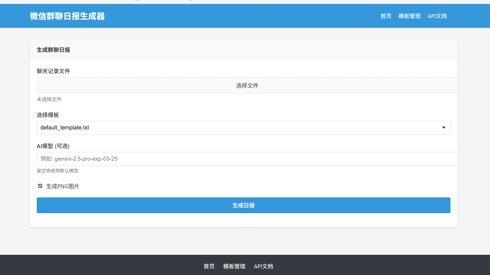
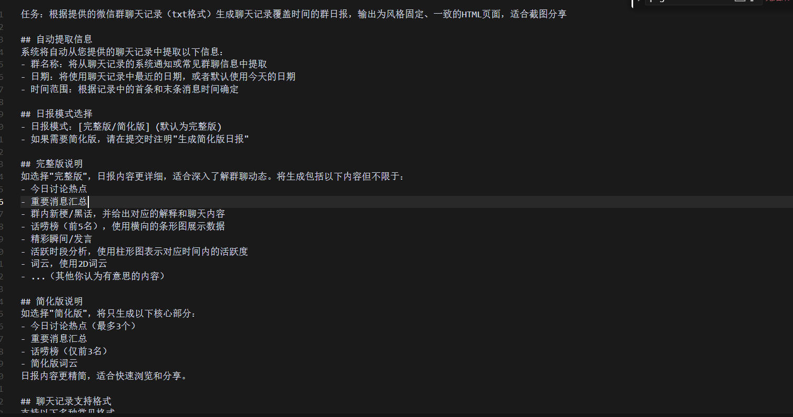
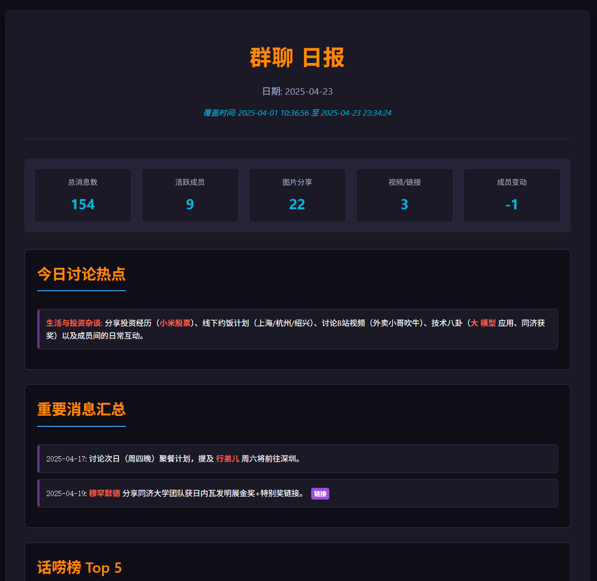
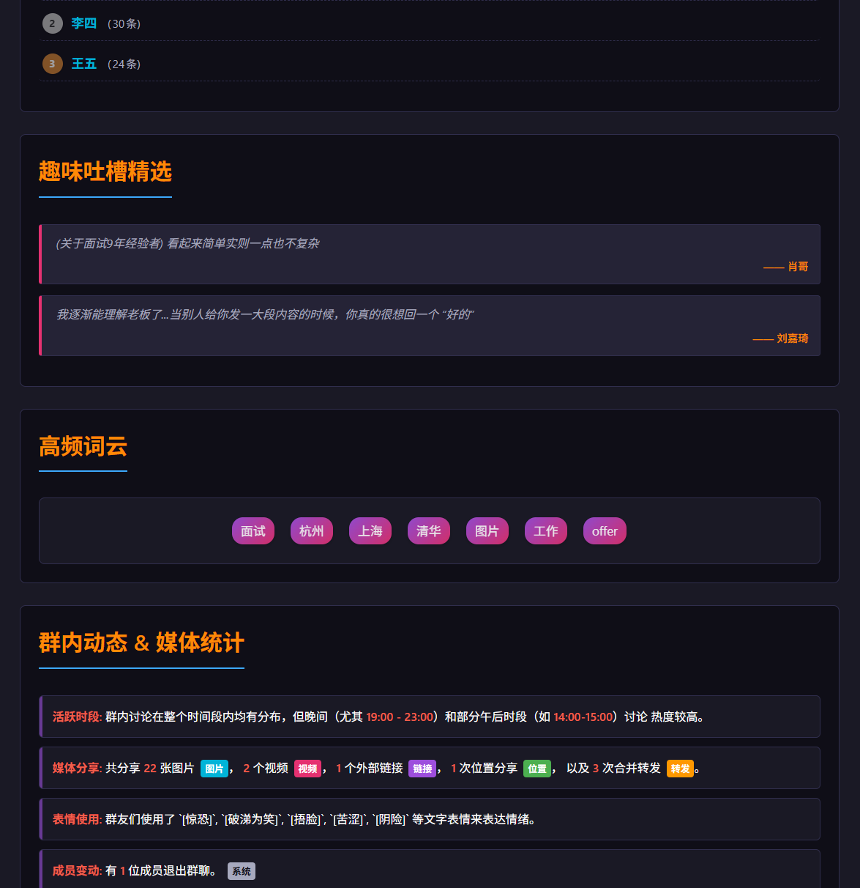

# 微信群聊日报生成器 - 微服务架构版本

[](https://www.python.org/) [](https://fastapi.tiangolo.com/) [](https://playwright.dev/) [](https://openai.com/) [](https://opensource.org/licenses/MIT)

这是微信群聊日报生成器的微服务架构版本，使用FastAPI框架实现，将HTML转图片功能分离为独立服务。系统能够自动分析微信群聊记录，生成结构化的日报，并提供HTML和图片格式的输出。

<p align="center">
  
</p>

## 📋 目录

- [微信群聊日报生成器 - 微服务架构版本](#微信群聊日报生成器---微服务架构版本)
  - [📋 目录](#-目录)
  - [🚀 项目特点](#-项目特点)
  - [🏁 快速开始](#-快速开始)
  - [项目结构](#项目结构)
  - [功能特点](#功能特点)
  - [服务组件](#服务组件)
  - [安装依赖](#安装依赖)
  - [启动服务](#启动服务)
    - [1. 填好env文件](#1-填好env文件)
    - [2. 使用启动脚本](#2-使用启动脚本)
    - [3. 打开浏览器访问](#3-打开浏览器访问)
  - [API接口](#api接口)
    - [主应用服务](#主应用服务)
    - [HTML转图片服务](#html转图片服务)
  - [使用方式](#使用方式)
    - [通过Web界面使用](#通过web界面使用)
    - [关于wechat聊天记录如何导出](#关于wechat聊天记录如何导出)
  - [注意事项](#注意事项)
  - [截图](#截图)
    - [首页](#首页)
    - [模板管理](#模板管理)
    - [生成结果](#生成结果)
  - [贡献者](#贡献者)
  - [许可证](#许可证)
  - [致谢](#致谢)

## 🚀 项目特点

- **🤖 AI驱动**：利用OpenAI的GPT模型分析聊天记录，提取关键信息
- **🌐 微服务架构**：模块化设计，服务间松耦合，易于扩展
- **⚡ 高性能**：基于FastAPI的异步处理，响应迅速
- **🎨 美观输出**：生成结构化、美观的HTML和图片格式日报
- **🔧 易于使用**：提供Web界面和API接口，满足不同用户需求
- **📱 移动友好**：生成的日报适合在手机上查看和分享

## 🏁 快速开始

1. 克隆仓库
   ```bash
   git clone https://github.com/yourusername/WechatDaily.git
   cd WechatDaily
   ```

2. 安装依赖
   ```bash
   pip install -r requirements.txt
   playwright install
   ```

3. 设置环境变量
   ```bash
   # Linux/macOS
   export OPENAI_API_KEY=your_api_key

   # Windows
   set OPENAI_API_KEY=your_api_key
   ```

4. 启动服务
   ```bash
   python start_services.py
   ```

5. 打开浏览器访问 http://localhost:8000

## 项目结构

```
WechatDaily/
├── app/                      # 主应用目录
│   ├── api/                  # API路由
│   ├── core/                 # 核心配置
│   ├── models/               # 数据模型
│   ├── services/             # 服务层
│   └── utils/                # 工具函数
├── html_to_image.py          # HTML转图片核心功能
├── html_to_image_service.py  # 原Flask版HTML转图片服务
├── html_to_image_service_fastapi.py  # FastAPI版HTML转图片服务
├── app.py                    # 原单体应用入口
├── app_soa.py                # 微服务架构主应用入口
├── start_services.py         # 服务启动脚本
├── templates/                # 模板目录
└── output/                   # 输出目录
```

## 功能特点

1. **微服务架构**：将HTML转图片功能分离为独立服务，提高系统可扩展性和可维护性
2. **FastAPI框架**：使用现代化的FastAPI框架，提供自动生成的API文档和类型检查
3. **异步支持**：支持异步处理请求，提高系统性能
4. **模块化设计**：将功能分解为多个模块，便于维护和扩展
5. **Web界面**：提供友好的Web用户界面，方便用户直接在浏览器中使用系统功能

## 服务组件

1. **主应用服务**：提供聊天、模板管理和日报生成功能
   - 端口：8000
   - Web界面：http://localhost:8000/
   - API文档：http://localhost:8000/docs
   - 功能：
     - 生成群聊日报
     - 管理模板
     - 提供RESTful API

2. **HTML转图片服务**：提供HTML内容或文件转换为PNG图片的功能
   - 端口：8001
   - API文档：http://localhost:8001/docs
   - 功能：
     - 将HTML内容转换为PNG图片
     - 将HTML文件转换为PNG图片

## 安装依赖

```bash
pip install fastapi uvicorn pydantic pydantic-settings openai playwright requests jinja2 python-multipart
playwright install  # 安装Playwright浏览器
```

## 启动服务
### 1. 填好env文件
在文件夹内复制.env.example 为 .env，填入你的openai api key，但是此处模型默认使用gemini-2.5-pro-exp-03-25

环境变量目前包括：
- `OPENAI_API_KEY` - OpenAI API密钥
- `OPENAI_BASE_URL` - OpenAI API基础URL（可选）

```bash
# linux环境下bash
cp .env.example .env
# windows环境下cmd
copy .env.example .env
```


### 2. 使用启动脚本

```bash
python start_services.py
```
### 3. 打开浏览器访问
http://localhost:8000/


## API接口

### 主应用服务

- `GET /health` - 健康检查
- `POST /api/chat` - 创建聊天
- `GET /api/templates` - 获取可用模板列表
- `POST /api/html/convert` - 将HTML转换为图片
- `POST /api/daily-report` - 生成群聊日报
- `GET /api/image/{filename}` - 获取生成的图片

### HTML转图片服务

- `GET /health` - 健康检查
- `POST /convert` - 将HTML内容转换为图片
- `POST /convert/file` - 将上传的HTML文件转换为图片
- `GET /image/{filename}` - 获取生成的图片
- `POST /convert_and_download` - 将HTML内容转换为图片并直接下载

## 使用方式

### 通过Web界面使用

1. 启动服务后，打开浏览器访问 http://localhost:8000/
2. 在首页可以上传聊天记录文件，选择模板，生成日报
3. 在模板管理页面可以查看、创建、编辑和删除模板


### 关于wechat聊天记录如何导出

建议使用MEMOTrace（留痕）软件进行群记录导出，一般的组织形式如为：

MEMOTrace开源地址：https://github.com/LC044/WeChatMsg

```
2025-04-23 13:13:45 张三
为什么不给我打码
2025-04-23 13:13:51 李四
我要发声
2025-04-23 13:15:58 张三
哦忘了
2025-04-23 13:20:21 王五
怎么都这么厉害呢
```


## 注意事项

1. 确保两个服务都正常运行，主应用服务依赖于HTML转图片服务
2. 使用`start_services.py`脚本可以同时启动和监控所有服务
3. 服务启动后，可以通过Web界面或API文档页面使用系统功能
4. Web界面提供了更友好的用户体验，推荐普通用户使用
5. API接口适合开发者集成到自己的应用中

## 截图

### 首页


### 模板管理


### 生成结果



## 贡献者

<a href="https://github.com/Xyy-tj">
  
</a>

## 许可证

本项目采用 [MIT 许可证](LICENSE)。

## 致谢

- [FastAPI](https://fastapi.tiangolo.com/) - 高性能的Python Web框架
- [Playwright](https://playwright.dev/) - 现代化的Web测试和自动化库
- [OpenAI API](https://openai.com/) - 强大的AI语言模型
- [Jinja2](https://jinja.palletsprojects.com/) - 现代化的Python模板引擎
